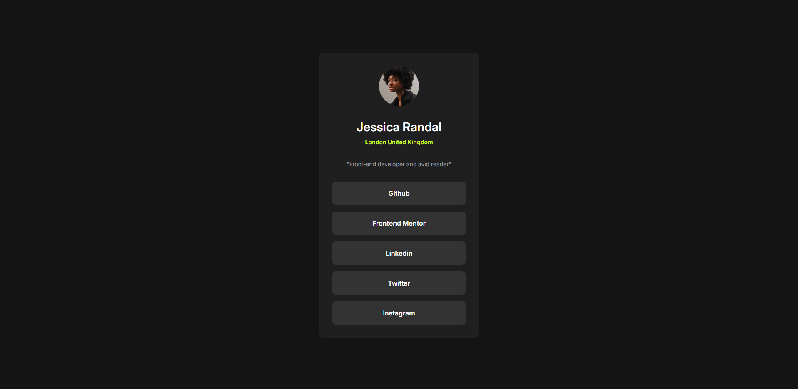

# Frontend Mentor - Social links profile solution

This is a solution to the [Social links profile challenge on Frontend Mentor](https://www.frontendmentor.io/challenges/social-links-profile-UG32l9m6dQ). Frontend Mentor challenges help you improve your coding skills by building realistic projects. 

## Table of contents

- [Overview](#overview)
  - [Screenshot](#screenshot)
  - [Links](#links)
- [My process](#my-process)
  - [Built with](#built-with)
  - [What I learned](#what-i-learned)
- [Author](#author)
- [Acknowledgments](#acknowledgments)

## Overview

### Screenshot

### Links

- Live Site URL: [Vercel](https://fementor-sociallinks.vercel.app/)

## My process
### Built with
- Semantic HTML5 markup
- Flexbox
- Mobile-first workflow
- [Tailwind](https://tailwindcss.com/) - CSS Framework

### What I learned

To be honnest, im not learn anything new but just practice my tailwind skills.

## Author

- Frontend Mentor - [@St4rkXc](https://www.frontendmentor.io/profile/St4rkXc)
- Instagram - [@dhios.ntz](https://www.instagram.com/dhios.ntz/)

## Acknowledgments

just do it

